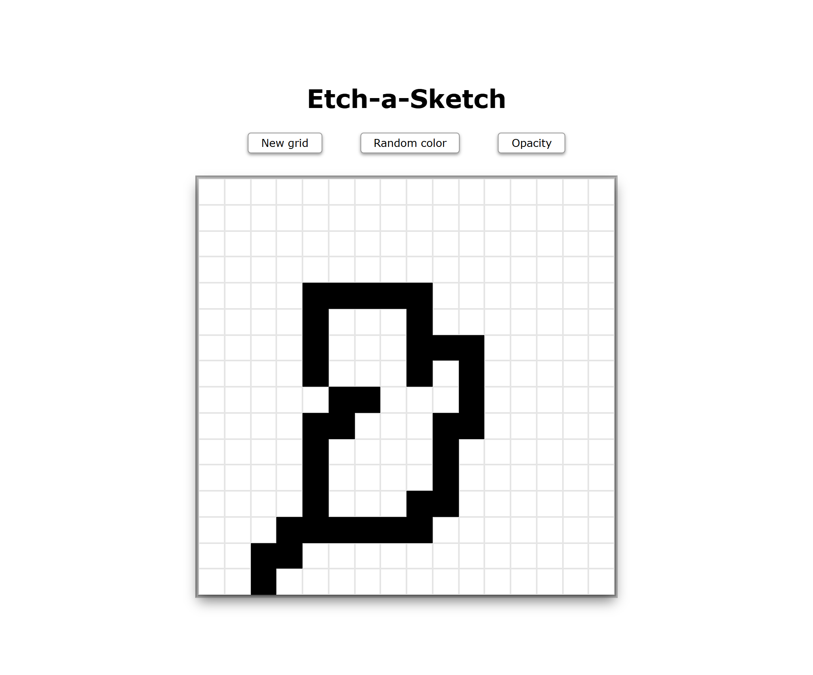

# Project: Etch-a-Sketch

## Description

In this project, I created an Etch-a-Sketch-like browser application using JavaScript, HTML, and CSS.
- Live preview: https://averdonks.github.io/etch-a-sketch/

## Features

- Grid generation (2x2 to 100x100)
- Toggle randomized colors
- Toggle opacity
    - Start at 10% opacity
    - Add 10%  for each mouse hover
    - Stop at 100% 

## Image Preview

## Skills

HTML/CSS
- Layout, structure, and style

JavaScript
- DOM manipulation and events

Git
- Version control

## Reflection

Completing this project  was a good exercise with utilizing DOM manipulation and events to add interactivity to a browser app.
